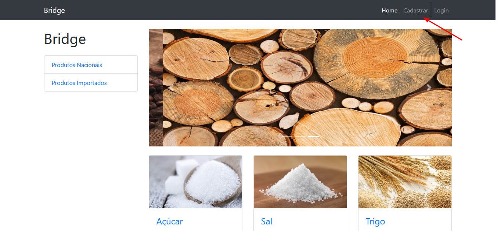
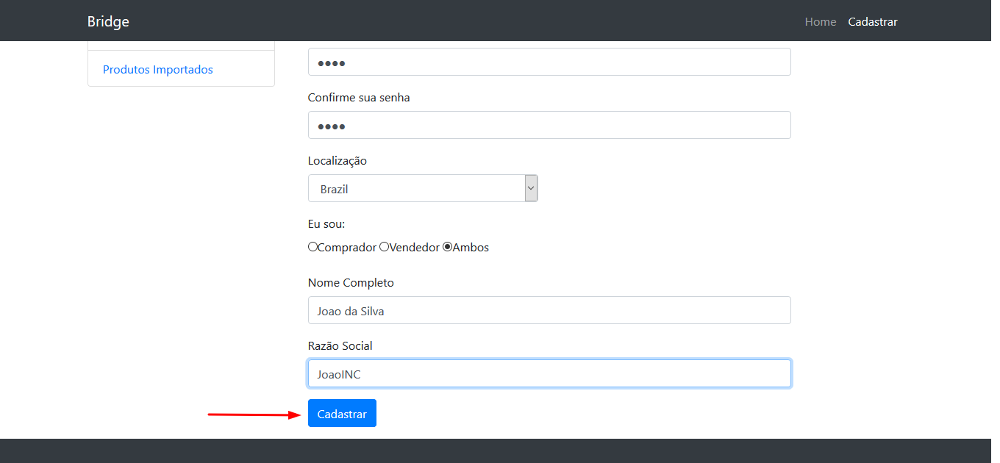
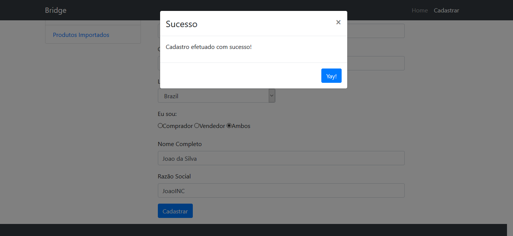
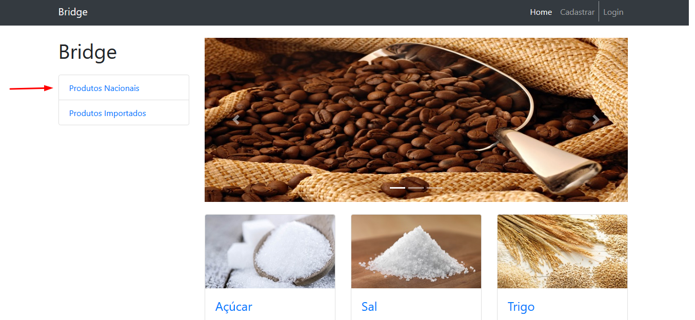
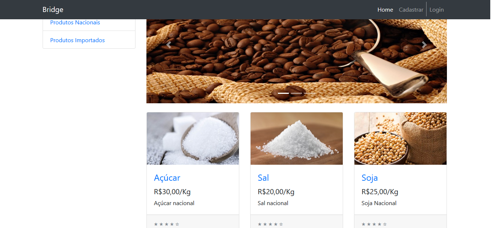
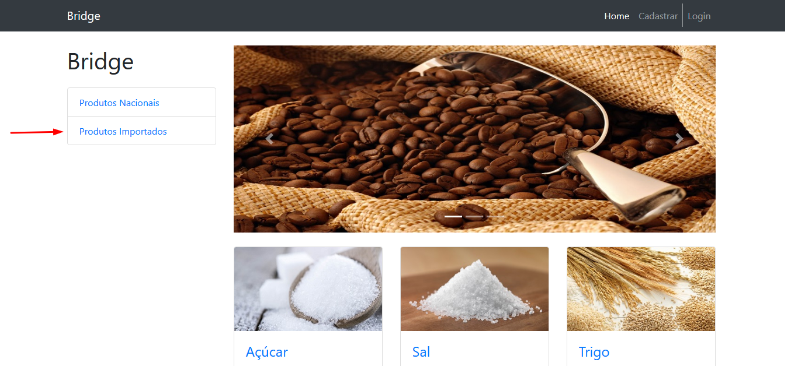
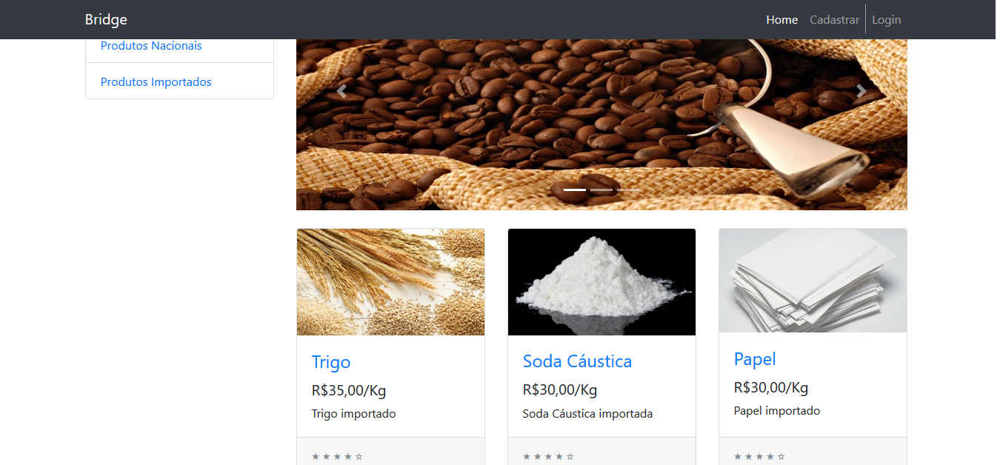
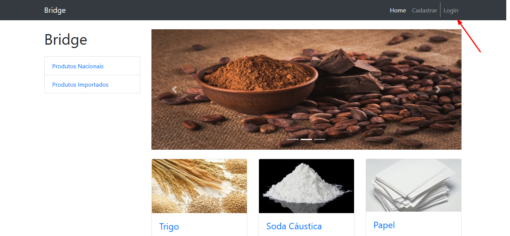
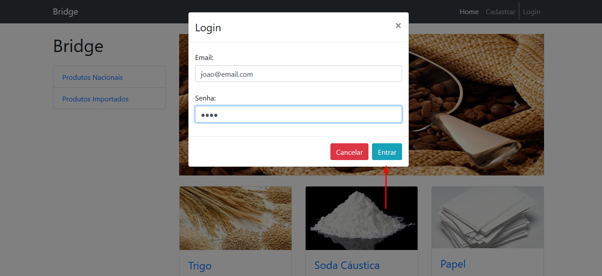
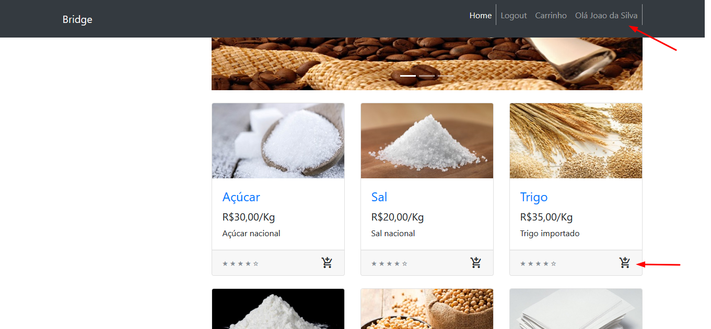

# Node.js Server para aplicação do Projeto Integrado

Esta aplicação foi desenvolvida para o projeto integrado dos alunos do 6o semestre do curso de Sistemas de Informação da Universidade Anhembi Morumbi. Esta aplicação utiliza as tecnologias Bootstrap, Jquery e JquerySession no front-end, e Node.js utilizando padrão DAO no backend.

Beatriz Alves
Lucas Hoberty
Ramon Castan

## Rodar o app localmente

1. Instale o [Node.js][]
+ acesse o diretório raiz do projeto
+ execute `npm install` para instalar as dependências do projeto
+ execute `npm start` para iniciar o app localmente
+ Acesse o app através do browser na porta disponibilizada no console <http://localhost:porta>

2. Apos acessar a rota, você chegará na tela inicial da aplicação, clique em "Cadastrar":

3. Preencha os dados conforme solicitado e clique em cadastrar:

4. Um pop-up deve aparecer caso o cadastro dê certo:

5. Clique no botão azul para retornar à tela inicial

6. Na tela inicial, clique em "Produtos Nacionais" para ativar o filtro de produtos:

7. Na tela inicial, clique em "Produtos Importado" para ativar o filtro de produtos:

8. Na tela inicial, clique em "Login".:

9. Deverá aparecer um pop-up com informações para login. Preencha-o com as informações de cadastro e clique em "Entrar":

10. Percebe-se o uso da Sessão através do uso do nome de usuário na tela inicial e a adição dos ícones de carrinho nos produtos:

[Install Node.js]: https://nodejs.org/en/download/
